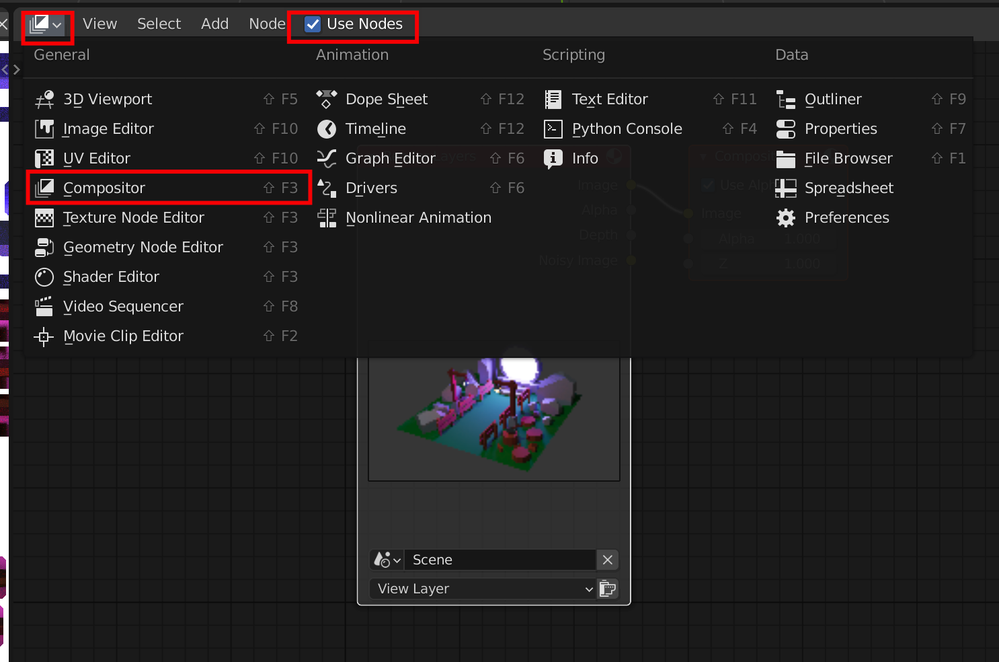

# Blender 常用知识点

## 快捷键 shortcut

-   `tab` 切换 object 模式和 edit 模式
    -   object model
    -   edit model
        -   `1` 点模式
            -   点几个点可以按`f`生成面
        -   `2` 边模式
            -   多个边选择之后`ctrl + l`可以通过边选择几条边形成的所有面
        -   `3` 面模式
            -   选择面之后可以点击`x`进行删除操作
-   `g` 移动
    -   衔接`x,y,z`可以在对应轴上移动
    -   edit model 可以配置编辑基点
    -   `gg` 在对象自身的轴上移动
    -   `shift + x\y\z` 避免在某一轴上操作
-   `s` 缩放
    -   衔接`x,y,z`可以在对应轴上缩放
-   `r` 旋转
    -   衔接`x,y,z`可以在对应轴上旋转
-   `shift + d` 复制成独立对象
    -   衔接`x,y,z`可以在对应轴上移动
-   `alt + d` 复制成引用对象（修改一个，克隆体也会被修改）
-   `cmd + l` 多选物体下，复制活动中的物体，选择复制它的属性
-   `esc` 取消操作
-   `shift + a` 添加对象
-   `x` 删除对象
-   `z` 切换渲染模式
    -   wireframe、solid、rendered、material preview 选项
-   `a` 全选
-   `m` 移动到集合
-   `ctrl + j` 合并 mesh
-   `p` 编辑模式根据选择拆分 mesh
-   `ctrl + r` 切面
-   `ctrl + space` 仅展示当前视图

## 模型性能优化

-   删除不显示的面
-   每个 mesh 拆分成独立对象和数据（不包含 material），`f3` 输入 `make single user object & data`
-   解决错误的朝向(face orientation)，蓝色是正确，红色是错误。错误的朝向，材质渲染(baked texture)时，会造成颜色错误
    -   选择 mesh 需要翻转的面，`f3` 输入 `flip`翻转即可
    -   或者`f3` 输入 `recalculate outside` 计算翻转（可能无效）

## UV 展开 unwrap

> 分为两种主要方式
>
> -   软件自动 unwrap，性能会差一些，但操作简单
> -   手动 unwrap，操作复杂，但处理正确的情况下，性能会高于自动化

-   全选所有 mesh，设它们的 scale 为 1，`ctrl + a` 选择 `scale`

-   选择 uv 展开的 mesh，`a`选择所有面，按`u`，选择`unwrap`进行 uv unwrap
-   设置`display strecth - area`，调整 uv unwrap 大小，尽量让其颜色相近
    -   选择一个面之后，可以通过`ctrl + l`选择这个 mesh

-   调整位置到合适的区域

## 烘焙贴图 baking texture

-   object mode 新建图片，下面为推荐值

-   保存成 HDR 格式，后续需要什么格式了再转

-   选择需要 baked 的 mesh 和 material，进入 shader mode

-   `shift + a` 添加 node，`texture` > `image texture`

-   编辑采样参数，点击`Baked`按钮

- hdr格式过大，需要转码成sRGB encoding用图

- 使用合成器(compositor)来解决颜色(Filmic)和噪点问题

- 添加image和denoise节点到合成器
  - 不使用的节点可以按 `m` 不启用

- 调整尺寸，然后`f12`保存 `alt + s` 通过合成器后的baked图

## 导出

- glb文件导出

- 按需要选择配置

- 如果遇到错误，尝试取消勾选compression
